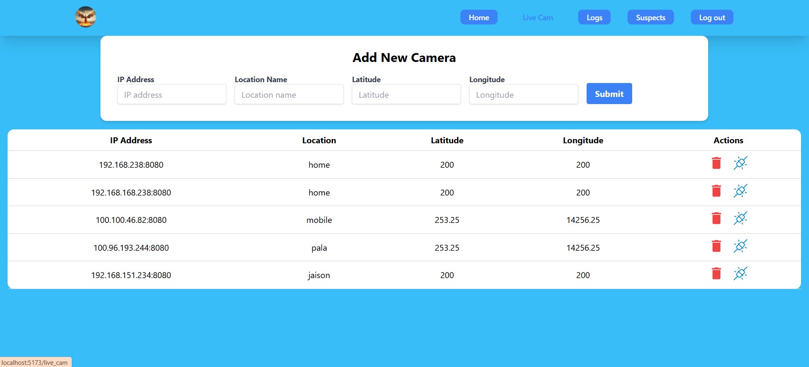

<div align="center">

# Face-Recognition-System

</div>
<div align="right">
  
[](https://firstdonoharm.dev/version/3/0/cl-soc-sv.html)

</div>

A real-time face recognition system using OpenCV and Python with LBPH and OpenCL for GPU acceleration. Integrated with a MERN stack web interface for video stream processing, user management, and logging of detected faces. This MCA mini project combines machine learning and web development.

---

## Table of Contents
- [Project Overview](#project-overview)
- [Features](#features)
- [Screenshots](#screenshots)
- [Technologies Used](#technologies-used)
- [Installation](#installation)
- [Usage](#usage)
- [Future Enhancements](#future-enhancements)
- [License](#license)
- [Acknowledgments](#acknowledgments)

---

## Project Overview
This Face Recognition System is designed to identify and log faces in real-time using live video streams. By leveraging the Local Binary Patterns Histogram (LBPH) algorithm with GPU acceleration via OpenCL, this system achieves efficient and accurate face detection. The project also includes a MERN stack-based web interface for managing users, viewing live feeds, and reviewing past detections.

## Features
- **Real-Time Face Recognition**: Detect faces from video streams with OpenCV and LBPH.
- **MERN Web Interface**: Frontend with React, backend API with Express and Node.js, and MongoDB for data storage.
- **User Management**: Admin dashboard to manage user roles and access permissions.
- **Logging and Reports**: Log detected faces with timestamps, including options for viewing detection history.
- **GPU Acceleration**: Uses OpenCL to optimize performance, especially useful for large datasets or high-resolution video feeds.

## Screenshots
<div align="center">

### Home Page


### Detection Logs


### Live camera feed


### Admin Dashboard


</div>

## Technologies Used
- **Frontend**: React, Tailwind CSS🎨
- **Backend**: Node.js, Express.js, MongoDB
- **Face Recognition**: OpenCV, LBPH Algorithm
- **GPU Acceleration**: OpenCL
- **Other Tools**: Python for machine learning, Firebase🔥 for authentication

## Installation
### Prerequisites
- [Node.js](https://nodejs.org/) and npm
- [Python 3.x](https://www.python.org/downloads/)
- MongoDB (local or [MongoDB Atlas](https://www.mongodb.com/cloud/atlas))
- OpenCV with OpenCL enabled

### Steps
1. **Clone the Repository**:
    ```bash
    git clone https://github.com/yourusername/Face-Recognition-System.git
    cd Face-Recognition-System
    ```

2. **Backend Setup**:
    - Navigate to the `backend` folder.
    - Install dependencies:
        ```bash
        npm init -y
        ```
    - Set up your `.env` file with MongoDB connection details.

3. **Frontend Setup**:
    - Navigate to the `frontend` folder.
    - Install dependencies:
<pre style=" color:skyblue; padding: 10px; border-radius: 5px;">
<code>
npm create vite@latest .
npm install
</code>
</pre>

    - Configure frontend environment variables as needed.

4. **Run the Application**:
    - Start the backend server:
        ```bash
        node index.js
        ```
        or use nodemon for live reloading:
        ```bash
        npm start
        ```
    - Start the frontend server:
        ```bash
        npm run dev
        ```

5. **Run Face Recognition Script**:
    - Ensure OpenCV is installed with OpenCL support.
    - Run the face detection script:
        ```bash
        cd Face-Recognition-System/recognition
        python gpu_video.py
        ```

## Usage
1. **Accessing the System**:
   - Open the frontend by visiting `http://localhost:3000`.
   - Log in as an admin to access the dashboard and manage settings.

2. **Adding Users and Cameras**:
   - Admins can add new users and cameras for live video monitoring.

3. **Viewing Logs**:
   - Navigate to the Logs section to view previous detections, timestamps, and other details.

## Future Enhancements
- **Advanced Face Recognition Models**: Integrate deep learning-based face recognition (e.g., FaceNet or DeepFace).
- **Enhanced Security**: Implement multi-factor authentication.
- **Improved Analytics**: Add more analytics for detection patterns and user behavior.

## License
This project is licensed under the [Hippocratic License HL3-CL-SOC-SV](https://firstdonoharm.dev/version/3/0/cl-soc-sv.html).

## Acknowledgments
Special thanks to the open-source community and to the authors of the packages and libraries used in this project.

---
<div align="center">

[](https://ko-fi.com/B0B615YOK7)

</div>